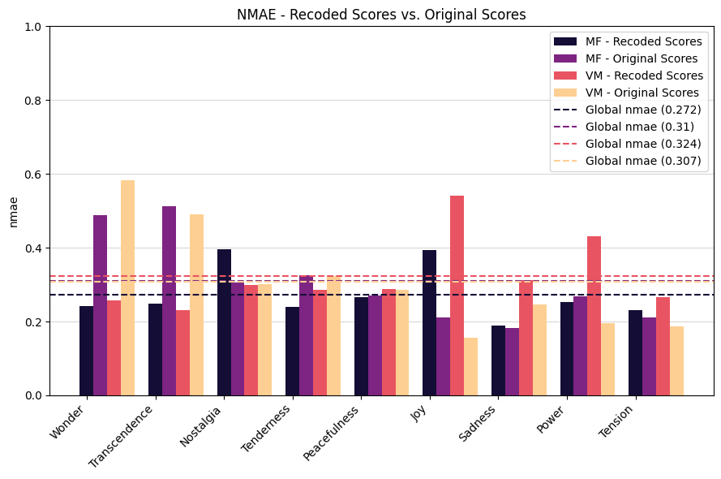
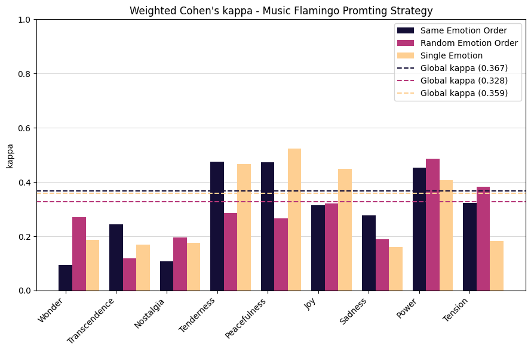
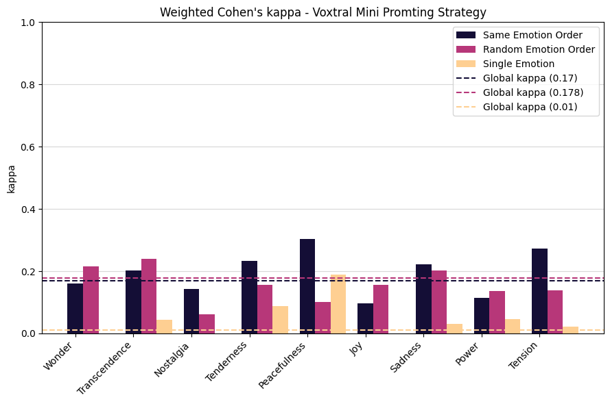

# Evaluating LALMs capabilities for Music Emotion Recognition

This study aims to test the capabilities of current Large Audio Language Models (LALM) for Music Emotion Recognition (MER). This project if part of a Masters Thesis conducted at the University of Lausanne under the direction of Davide Picca. It is carried out in colaboration with EPFL's Cultural Heritage & Innovation Center, wich is responsible for digitizing, enriching and preserving the collection of Montreux Jazz Festival (MJF) recordings.

To this extent, two open-source LALMs were selected: [Music Flamingo](https://huggingface.co/nvidia/music-flamingo-hf) and [Voxtral Mini](https://huggingface.co/mistralai/Voxtral-Mini-3B-2507). These models were then asked to predict the nine emotions defined by the [Geneva Emotion Scale](https://musemap.org/resources/gems) (GEMS) of music excerpts. The excerpts were taken from [the Emotion-to-Music-Mapping-Atlas](https://musemap-tools.uibk.ac.at/emma/) (EMMA) study.

The models were first evaluated in their zero-shot configuration. During this phase, experiments were conducted to assess the impact of the emotional score format. Two types of scores were tested: the original continuous scale ranging from 0 to 100, and a Likert-type discrete scale ranging from 1 to 5.<br>



Three prompting strategies were also evaluated:
1. The nine emotions are requested together in a fixed order.
2. The nine emotions are requested together in a random order.
3. Each emotion is requested separately.

<p float = "left">
    
    
</p>


The last phase of the study consisted of a LoRA fine-tuning of the two models on the EMMA dataset. The resut of the finetune showed significant improvments for *Voxtral Mini*, whereas *Music Flamingo's* prediction collapsed towards the dominant scores in the dataset.


The fine-tuned version of *Voxtral Mini* was tested on new data consisting of music excerpts from concerts at the Montreal Jazz Festival. A small dataset was annotated using GEMS, and the responses of the single annotator were compared to the model’s predictions.

## Code and execution
<details open>
<summary><strong>Detailed Project file structure</strong></summary>
<pre>
MJF-GEMS-Annotations
├── data                                <- Contains the original data and the train/test/valid datasets after processing
├── Music Flamingo
│   ├── model-training
│   │   ├── checkpoints                 <- Checkpoints saved during training
│   │   ├── configs                     <- Training configs
│   │   │   ├── base.yaml
│   │   │   └── debug.yaml
│   │   ├── music-flamingo              <- Local version of Music Flamingo
│   │   ├── src
│   │   │   ├── __pycache__
│   │   │   ├── dataset.py              <- Dataset Class and colate function
│   │   │   ├── model.py                <- Loads model and processor, LoRA hyperparameters configuration
│   │   │   ├── trainer.py              <- Training loop
│   │   │   ├── utils.py                <- Dataclasses Configuration & device selection
│   │   │   └── __init__.py
│   │   └── train.py
│   └── mf_one_shot_test.ipynb          <- Music Flamingo predictions script
├── results
│   ├── MF-fine-tuned                   <- LoRA fine-tune of Music Flamingo
│   ├── Voxtral-fine-tuned              <- LoRA fine-tune of Voxtral Mini
│   ├── MF_finetuned_results.csv        <- .csv files with the models predictions
│   └── ...
├── utils
│   ├── data_analysis.ipynb             <- Description and preprocessing of the dataset
│   ├── download_models.py              <- Downloads each model           
│   ├── process_MFJ_tracks.ipynb        <- Processing of the MJF tracks
│   ├── result_analysis.ipynb           <- Results metrics computation and graphs
│   └── track_download.py               <- Downloads the music excerpts from dataset
├── Voxtral
│   ├── model-training
│   │   ├── checkpoints                 <- Checkpoints saved during training
│   │   ├── configs                     <- Training configs
│   │   │   ├── base.yaml
│   │   │   └── debug.yaml
│   │   ├── src
│   │   │   ├── __pycache__
│   │   │   ├── dataset.py              <- Dataset Class and colate function
│   │   │   ├── model.py                <- Loads model and processor, LoRA hyperparameters configuration
│   │   │   ├── trainer.py              <- Training loop
│   │   │   ├── utils.py                <- Dataclasses Configuration & device selection
│   │   │   └── __init__.py
│   │   ├── voxtral-mini                <- Local version of Voxtral Mini
│   │   └── train.py
│   └── voxtral_one_shot_test.ipynb     <- Voxtral Mini predictions script
├── mjf_vm_ft_pred.py                   <- Prediction for MJF dataset with finetuned Voxtral Mini
└── requierments.txt
</pre>
</details>

### Initialisation

I recommend creating a virtual enviroment for the ececution of the different scripts. To do so execute the following line in the CLI:
```bash
python -m venv ven
```
Access the environement with the following command:
```bash
ven/Scripts/activate
```
Install all the dependencies. (The version of the packages is important, some newer version introduce errors.)
```bash
pip install -r requierments.txt
```
### Using the models

The instructions for using the models in either their *zero-shot* configuration or their fine-tuned versions are provided in their dedicated notebooks.
- ``mf_one_shot_test.ipynb`` for Music Flamingo
- ``voxtral_one_shot_test.ipynb`` for Voxtral Mini

### Fine-tuning the models

To fine-tune the models, execute the following commands in the CLI from their respective root folders  (``Music Flamingo/model-training`` or ``Voxtral/model-training``).

- Complete fine-tuning:<br>

```bash
python train.py --config configs/base.yaml
```
- Debug fine-tuning:<br>
```bash
python train.py --config configs/base.yaml --override configs/debug.yaml
```
- Fine-tuning with custom hyperparameters:<br>
```bash
python train.py --config configs/base.yaml epochs=1 lr=1e-4
```
